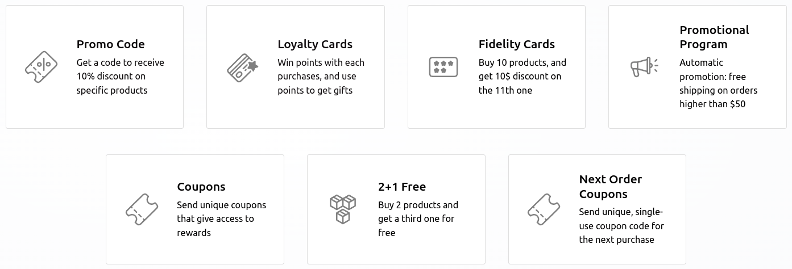
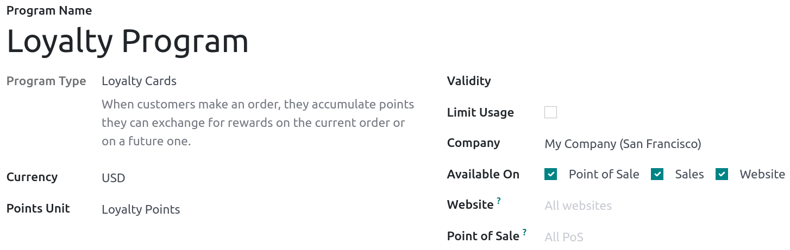
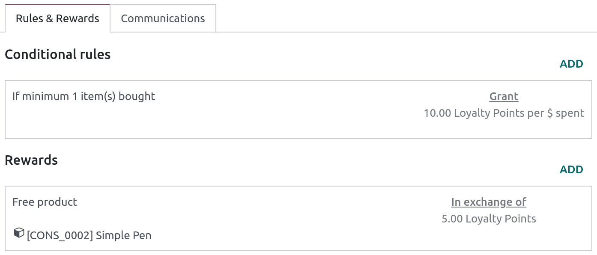
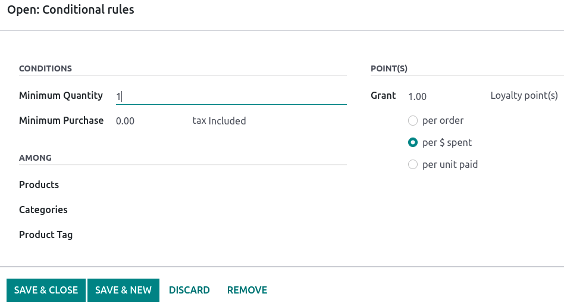
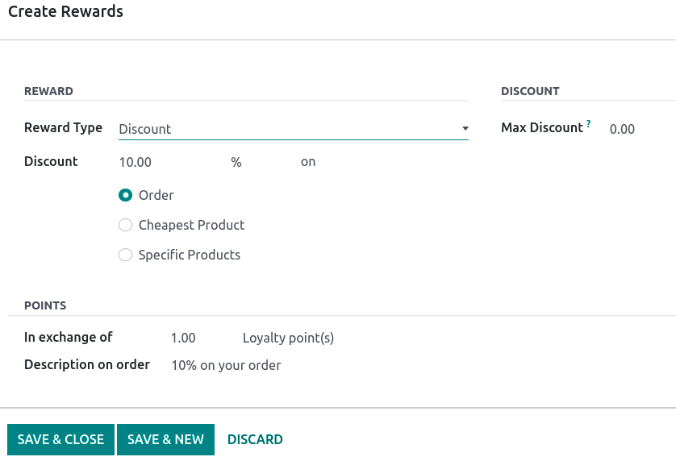

=================================
Use discount and loyalty programs
=================================

With Odoo, customers can use promotion and loyalty programs for online and in-store shopping. To
create promotion and loyalty programs, which offer different options from
:doc:`pricelists <prices/pricing>`, go to :menuselection:`Sales --> Products --> Discount
& Loyalty`. Then, either :guilabel:`Create` a program from scratch, use one of the templates, or
modify an existing program.

.. note::
   Templates disappear once a program is created.

.. _pricing_management/program-types:

The different program types are:

- :guilabel:`Coupons`: Generate and share single-use coupon codes that grant immediate access to
  rewards;
- :guilabel:`Next Order Coupons`: Generate and share single-use coupons that grant access to rewards
  on the next order;
- :guilabel:`Promotions`: Set conditional rules when ordering, which when fulfilled, grant access to
  rewards for the customers;
- :guilabel:`Discount Code`: Set codes which, when entered upon checkout, grant customers a
  discount;
- :guilabel:`Loyalty Cards`: When buying from the shop, customers can receive and accumulate points
  to exchange for rewards on future orders;
- :guilabel:`Buy X Get Y`: For each item bought, customers are granted 1 credit. After accumulating
  a specified amount of credits, customers can trade them in to receive Y item.

Configuration
=============

When creating or modifying a program, the options available depend on the :guilabel:`Program Type`
selected. Therefore, some programs may have additional options only available to them.

- :guilabel:`Program Name`: Enter the name of the program. The name is not visible to the customer;
- :guilabel:`Program Type`: The desired :ref:`program type <pricing_management/program-types>` to
  use;
- :guilabel:`Currency`: The currency used for that program;
- :guilabel:`Points Unit`: The unit of point used for the :guilabel:`Loyalty Cards` program. The
  name is arbitrary.
- :guilabel:`Validity`: The date until which the program is valid;
- :guilabel:`Limit Usage`: The limited amount of times the program can be used during the
  :guilabel:`Validity`;
- :guilabel:`Company`: In case of multiple companies, the company in which the program is
  available;
- :guilabel:`Available On`: Select on which app the program is available on;
- :guilabel:`Website`: The website(s) for which the program is available. Leave the field empty to
  make it available for *all* websites;
- :guilabel:`Point of Sale`: The PoS in which the program is available. Leave the field empty to
  make it available in *all* PoS.

The number of existing cards, discounts, etc., per program is available under the related smart
button in the upper-right corner.

.. image:: loyalty_discount/price-programs-items.png
   :align: center
   :alt: Program items tab

Conditional rules
-----------------

Depending on the program, the :guilabel:`Rules & Rewards` tab allows to set conditions and points
value. Click :guilabel:`Add` in the :guilabel:`Conditional rules` column to add **conditions**.

- :guilabel:`Minimum Quantity`: The minimum quantity that must be bought to access the reward;
- :guilabel:`Minimum Purchase`: The minimum amount (in currency) :guilabel:`tax Included` or
  :guilabel:`tax Excluded` to access the reward. Both quantity *and* amount can be combined;
- :guilabel:`Products`: The product(s) to which the program applies;
- :guilabel:`Categories`: The category of products to which the program applies. Select
  :guilabel:`All` to apply to *all* categories;
- :guilabel:`Product Tag:` Select a tag to apply the program to products containing that tag;
- :guilabel:`Grant`: Set the number of points the customer can earn :guilabel:`per order`,
  :guilabel:`per currency spent`, or :guilabel:`per unit paid`.

.. note::
   The :guilabel:`Grant` option is only available for the :guilabel:`Fidelity Cards, 2+1 Free`, and
   :guilabel:`Loyalty Cards` programs.

Rewards
-------

Click :guilabel:`Add` in the :guilabel:`Rewards` column to add **rewards**.

.. note::
   The :guilabel:`Rewards` may differ depending on the selected :guilabel:`Program Type`.

- :guilabel:`Reward Type`: Select the reward type among :guilabel:`Discount`,
  :guilabel:`Free product`, and :guilabel:`Free Shipping`;
- :guilabel:`Discount`: The discounted amount in :guilabel:`%`, :guilabel:`currency per point`, or
  :guilabel:`currency per order` on either the :guilabel:`Order`, the :guilabel:`Cheapest Product`,
  or :guilabel:`Specific Products`;
- :guilabel:`In exchange of`: Enter the required number of tokens or points earned by the customer
  to be exchanged for the reward;
- :guilabel:`Description on order`: The description of the reward displayed upon checkout;
- :guilabel:`Max Discount`: The maximum amount (in currency) granted by the discount. Leave on `0`
  for unlimited amounts;
- :guilabel:`Discounted Products`: The selected product(s) eligible for discount;
- :guilabel:`Discounted Prod. Categories`: The product category eligible for discount. Select
  :guilabel:`All` for all categories;
- :guilabel:`Discounted Prod. Tag`: The products eligible for discount according to their tag.

