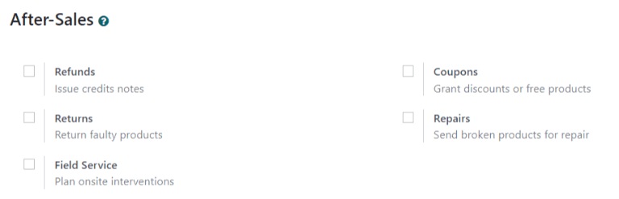
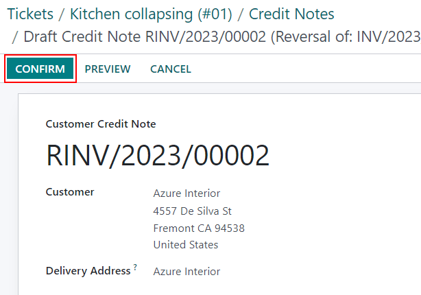
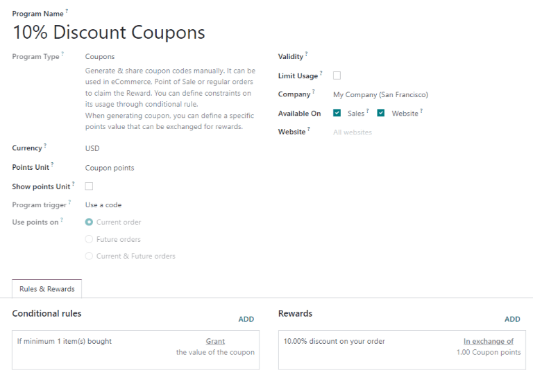
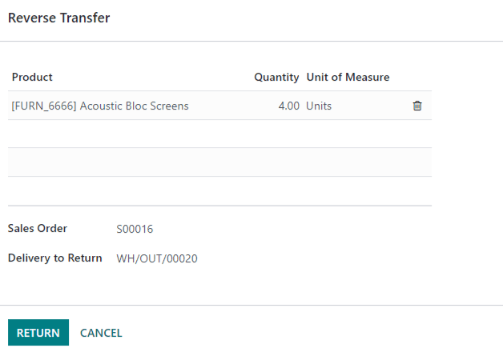
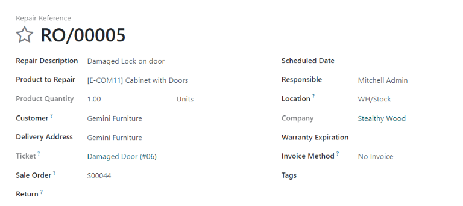
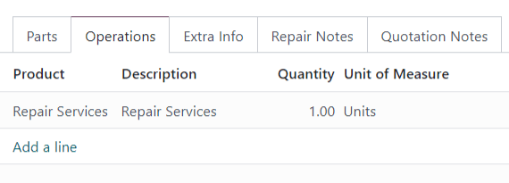
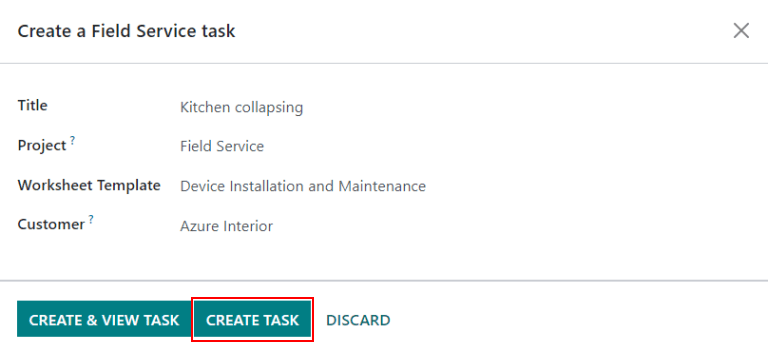

====================
After-Sales services
====================

*After-Sales* services can be configured in the :guilabel:`Helpdesk` application within an
individual :guilabel:`Team`. Once enabled, users can issue refunds, process returns, generate
coupons, and/or schedule repairs and field service interventions directly from a ticket.

Set up the After-Sales services
===============================

Go to :menuselection:`Helpdesk --> Configuration --> Teams` to select a :guilabel:`Team`. Scroll to
the :guilabel:`After-Sales` section and choose which of the following options to enable:

- :guilabel:`Refunds`: Issues credit notes to refund a customer, or adjust the remaining amount due.
- :guilabel:`Coupons`: Offers discounts and free products through an existing coupon program.
- :guilabel:`Returns`: Initiates a product return from a customer through a reverse transfer.
- :guilabel:`Repairs`: Creates repair orders for broken or faulty products.
- :guilabel:`Field Service`: Plans onsite intervention through the Field Service application.

.. warning::
   As all of the After-Sales services require integration with other applications, enabling any of
   them may result in the installation of additional modules or applications. *Installing a new
   application on a One-App-Free database will trigger a 15-day trial. At the end of the trial, if a
   paid subscription has not been added to the database, it will no longer be accessible.*

Issue a refund with a credit note
=================================

A *credit note* is a document issued to a customer informing them that they have been credited a
certain amount of money. They can be used to provide a full refund to a customer, or to adjust any
remaining amount due. While they are usually created through the :menuselection:`Accounting` or
:menuselection:`Invoicing` applications, they can be created through a :menuselection:`Helpdesk`
:guilabel:`Ticket`.

.. note::
   Invoices must be posted before a credit note can be generated.

To create a credit note from a :menuselection:`Helpdesk` :guilabel:`Ticket`, click on the
:guilabel:`Refund` button in the upper left corner. Select the corresponding invoice from the
:guilabel:`Invoices to Refund` drop-down.

.. image:: after_sales/after-sales-refund-details.png
   :align: center
   :alt: View of a refund creation page.

Choose a :guilabel:`Credit Method` from one of the following options:

- :guilabel:`Partial Refund`: The credit note is created in draft and can be edited before being
  issued.
- :guilabel:`Full Refund`: The credit note is auto-validated and reconciled with the invoice. *This
  is the option to choose if a validated invoice needs to be canceled*.
- :guilabel:`Full refund and new draft invoice`: The credit note is auto-validated and reconciled
  with the invoice. The original invoice is duplicated as a new draft. *This is the option to choose
  if a validated invoice needs to be modified.*

.. important::
   The :guilabel:`Credit Method` options will *not* be available for invoices that have already been
   paid.

Make any necessary changes to the details of the credit note and click :guilabel:`Reverse.` Then
click :guilabel:`Confirm` to post the credit note.

Once the credit note has been posted, a :guilabel:`Credit Notes` smart button will be added to the
:menuselection:`Helpdesk` :guilabel:`Ticket`.

.. image:: after_sales/after-sales-credit-note-smart-button.png
   :align: center
   :alt: View of smart buttons on a ticket focusing on the credit note button.

.. seealso::
   - :doc:`/applications/finance/accounting/receivables/customer_invoices/credit_notes`

Generate coupons from a ticket
==============================

Coupons can be used to alter the price of products or orders. The usage constraints of a coupon are
defined by conditional rules. *Coupon Programs* are configured in the :menuselection:`Sales` or
:menuselection:`Website` applications.

.. note::
   The :menuselection:`eCommerce` module must be installed in order to create coupon codes from the
   :menuselection:`Website` application.

To generate a coupon, open a :menuselection:`Helpdesk` :guilabel:`Ticket` and click on the
:guilabel:`Coupon` button in the upper left corner. Select an option from the :guilabel:`Coupon
Program` drop-down menu. Click :guilabel:`Generate`.

.. image:: after_sales/after-sales-generate-coupon.png
   :align: center
   :alt: View of a coupon generation window.

The :guilabel:`Coupon Code` can be copied directly from the pop-up window (by clicking the
:guilabel:`Copy` button), or sent in an email by clicking :guilabel:`Send`.

.. note::
   All followers of the :guilabel:`Ticket` will be added as recipients to the email. Additional
   recipients can be added to the email as well.

   .. image:: after_sales/after-sales-coupon-email.png
      :align: center
      :alt: View of an email draft window with coupon code.

Once a :guilabel:`Coupon Code` has been generated, a :guilabel:`Coupons` smart button will be added
to the top of the :menuselection:`Helpdesk` :guilabel:`Ticket`. Click here to view the coupon code,
expiration date, and additional information.

.. image:: after_sales/after-sales-coupon-smart-button.png
   :align: center
   :alt: View of the smart buttons on a ticket focusing on the coupon button.

.. seealso::
   `After-Sales Features <https://www.odoo.com/slides/slide/after-sales-features-1699>`_

Facilitate a product return with a reverse transfer
===================================================

Returns are completed through *reverse transfers*, which generate new warehouse operations for the
returning products. Click the :guilabel:`Return` button at the top left of a :guilabel:`Ticket` to
open the :guilabel:`Reverse Transfer` pop-up window.

.. image:: after_sales/after-sales-return-button.png
   :align: center
   :alt: View of a Helpdesk ticket with the return button highlighted.

.. note::
   The :guilabel:`Return` button will only appear on a :guilabel:`Ticket` if the customer selected
   has recorded deliveries in the database.

By default, the quantity will match the validated quantity from the delivery order. Update the
:guilabel:`Quantity` field if necessary.

Click :guilabel:`Return` to confirm the return. This generates a new warehouse operation for the
incoming returned product(s). A :guilabel:`Returns` smart button will then be added to the top of
the :menuselection:`Helpdesk` :guilabel:`Ticket`.

.. image:: after_sales/after-sales-return-smart-button.png
   :align: center
   :alt: View of the return smart button on a helpdesk ticket.

.. seealso::
   :doc:`/applications/sales/sales/products_prices/returns`

Send products for repair from a ticket
======================================

If the :guilabel:`Ticket` is related to an issue with a faulty or broken product, a repair order
can be created from the :menuselection:`Helpdesk`, and managed through the :menuselection:`Repair`
application.

To create a new repair order, click :guilabel:`Repair`.

If a product was specified in the :guilabel:`Product` field on the ticket, it will be automatically
added to the :guilabel:`Product to Repair` field on the newly created :guilabel:`Repair Reference`.
If applicable, add the :guilabel:`Sale Order` and :guilabel:`Return Order` from which the faulty
product originates.

Select the :guilabel:`Invoice Method`. If the customer will not be charged for this repair, this
field can be left unchanged.

If parts are required for the repair, they can be added in the :guilabel:`Parts` tab. Services can
be added as product lines on the :guilabel:`Operations` tab. Additional information for the internal
repair team can be added to the :guilabel:`Repair Notes` tab. Information for the customer can
be added to the :guilabel:`Quotation Notes` tab, and will be automatically added to the PDF of the
quotations generated from this :guilabel:`Repair Reference`.

A :guilabel:`Repairs` smart button will be added to the :menuselection:`Helpdesk`
:guilabel:`Ticket`, linking to the repair order.

.. image:: after_sales/after-sales-repair-smart-button.png
   :align: center
   :alt: View of smart buttons focusing on repair button.

.. note::
   If a user creates a repair order from a :menuselection:`Helpdesk` :guilabel:`Ticket`, they will
   be able to access it through the ticket's :guilabel:`Repairs` smart button, or from the link in
   the :guilabel:`Chatter`, even if they do not have access rights to the :menuselection:`Repair`
   application.

Create a field service task from a ticket
=========================================

On-site interventions can be planned from a :guilabel:`Ticket` and managed through the
:menuselection:`Field Service` application. Customers with portal access will be able to track the
progress of a :guilabel:`Field Service` task just as they would a :menuselection:`Helpdesk`
:guilabel:`Ticket`.

To create a new task, go to a :menuselection:`Helpdesk` :guilabel:`Ticket` and click
:guilabel:`Create Task`. Confirm the :guilabel:`Field Service Project` and :guilabel:`Worksheet
Template`, then click :guilabel:`Create Task`. A new task will be created within the designated
:guilabel:`Field Service` project.

A :guilabel:`Sales Order Item` on the :menuselection:`Helpdesk` :guilabel:`Ticket` can be added at
this time, if one was not identified on the original ticket.

.. important::
   The :guilabel:`Sales Order Item` is used to determine where time spent on this task will be
   invoiced. Removing the :guilabel:`Sales Order Item` makes the task non-billable.

A :guilabel:`Tasks` smart button will be added to the :menuselection:`Helpdesk` :guilabel:`Ticket`,
linking the :guilabel:`Field Service` task.

.. image:: after_sales/after-sales-field-service-smart-button.png
   :align: center
   :alt: View of ticket smart buttons focused on task.

.. seealso::
   `Field Service <https://www.odoo.com/slides/slide/advanced-settings-862?fullscreen=1>`_
