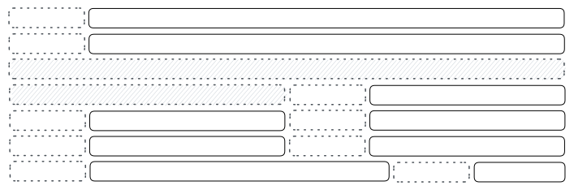

.. _reference/user_interface/views/form:

Form
====

Form views are used to display the data from a single record. Their root element is
``<form>``. They are composed of regular HTML_ with additional structural and semantic
components.

.. code-block:: xml

  <form>
    CONTENT
  </form>

Optional attributes_ are added on root element is ``<form>`` to customize the view.

:string:
  string_

  View name

:create:
  boolean_

  Disable/enable record creation on the view.

:edit:
  boolean_

  Disable/enable record editing on the view.

:delete:
  boolean_

  Disable/enable record deletion on the view through the **Action** dropdown.

:js_class:
  string_

  Name of the javascript class to use when instantiating the view.

:disable_autofocus:
  boolean_

  Disable automatic focus of the first field in the view.

.. _reference/user_interface/views/form/semantic:

Semantic components
-------------------

Semantic components tie into and allow interaction with the Odoo
system. Placeholders are denoted in all caps.

.. _reference/user_interface/views/form/field:

<field>: render formatted values
~~~~~~~~~~~~~~~~~~~~~~~~~~~~~~~~

.. code-block:: xml

  <form>
    <field name="FIELD_NAME"/>
  </form>

renders (and allow editing of, possibly) a single field of the current
record. Using several times a field in a form view is supported and the fields
can receive different values for modifiers 'invisible' and 'readonly'. However,
the behavior is not guaranteed when several fields exist with different values
for modifier 'required'. Possible attributes of the field node are:

Some attributes can use `python expression`_, in this case this expression is
evaluated with the values of the current view. In case of nested view, the
magic value `parent` refere to the values from container view.

:name:
  string_ (mandatory)

  the name of the field to render

:id:
  string_

  the node id. Useful when there are several occurrences of the same field in
  the view (see ``label`` component below). Default is the field name.

:widget:
  string_

  fields have a default rendering based on their type
  (e.g. :class:`~odoo.fields.Char`, :class:`~odoo.fields.Many2one`).

  The ``widget`` attributes allows using a different rendering method and context.
  See more information in :ref:`reference/js/widgets`

  .. code-block:: xml

    <field name="tag_ids" widget="many2many_tags"/>

:options:
  `python expression`_ that defines a dict_

  JSON object specifying configuration option for the field's widget
  (including default widgets)

  .. code-block:: xml

    <field name="tag_ids" widget="many2many_tags" options="{'color_field': 'FIELD_NAME', 'no_quick_create': True}"/>

:groups:
  `Comma-separated values`_ whose choices are the :class:`~odoo.addons.base.models.res_users.Groups` reference

  only displays the field for specific users

  .. code-block:: xml

    <field name="fname" groups="base.group_no_one,!base.group_multi_company"/>

:domain:
  `python expression`_ that defines a :ref:`reference/orm/domains`

  for relational fields only, filters to apply when displaying existing
  records for selection

  .. code-block:: xml

    <field name="fname_id" domain="[('fname_a', '=', parent.fname_b)]"/>

:context:
  `python expression`_ that defines a dict_

  for relational fields only, context to pass when fetching possible values

  .. code-block:: xml

    <field name="fname" context="{
        'TYPE_view_ref': 'ADDON.MODEL_view_TYPE',
        'group_by': 'FIELD_NAME',
        'default_FIELD_NAME': ANY,
        'search_default_FIELD_NAME': True,
        'OTHER_BUSINESS_KEY': ANY,
      }"/>

:readonly:
  `python expression`_ that defines a boolean_

  standard dynamic attributes based on record values. If the value is
  trully or the result is trully, display the field in both readonly
  and edit mode, but never make it editable.

  .. code-block:: xml

    <field name="fname_a" readonly="True"/>
    <field name="fname_b" readonly="fname_c != 3 and fname_a == parent.fname_d"/>

:required:
  `python expression`_ that defines a boolean_

  standard dynamic attributes based on record values. If the value is
  trully or the result is trully, generates an error and prevents
  saving the record if the field doesn't have a value

  .. code-block:: xml

    <field name="fname_a" required="True"/>
    <field name="fname_b" required="fname_c != 3 and fname_a == parent.fname_d"/>

:invisible:
  `python expression`_ that defines a boolean_

  standard dynamic attributes based on record values. Hide the field
  if trully or if the result is trully

  .. code-block:: xml

    <field name="fname_a" invisible="True"/>
    <field name="fname_b" invisible="fname_c != 3 and fname_a == parent.fname_d"/>

:nolabel:
  boolean_

  don't automatically display the field's label, only makes sense if the
  field is a direct child of a ``group`` element

:placeholder:
  string_

  help message to display in *empty* fields. Can replace field labels in
  complex forms. *Should not* be an example of data as users are liable to
  confuse placeholder text with filled fields

:mode:
  `Comma-separated values`_ whose choices are: ``kanban``, ``from``, ``tree``

  for :class:`~odoo.fields.One2many`, display mode (view type) to use for
  the field's linked records. One of ``tree``, ``form``, ``kanban`` or
  ``graph``. The default is ``tree`` (a list display)

:help:
  string_

  tooltip displayed for users when hovering the field or its label

:class:
  string_ `HTML class`_

  `HTML class`_ to set on the generated element.

  The styling use the Bootstrap_ framework and :ref:`UI icons <reference/user_interface/icons>`.

  Below are the common Odoo_ classes:

  ``oe_inline``: prevent the usual line break following fields and limit their span.

  ``oe_left``, ``oe_right``: floats_ the field to the corresponding direction

  ``oe_read_only``, ``oe_edit_only``: only displays the field in the corresponding form mode

  ``oe_avatar``: for image fields, displays images as "avatar" (square, 90x90 maximum size, some image decorations)

:filename:
  string_

  for binary fields, name of the related field providing the name of the file

:password:
  boolean_

  indicates that a :class:`~odoo.fields.Char` field stores a password and
  that its data shouldn't be displayed

:kanban_view_ref:
  string_ defined by the pattern: ``%(ADDON.MODEL_view_TYPE)s`` (target the :ref:`view reference <reference/view_record>`)

  for opening specific kanban view when selecting records from m2o/m2m in mobile
  environment

:default_focus:
  boolean_

  defines the field on which the focus will be made when displaying the form view

:ref:`Relational fields <studio/fields/relational-fields>` node can contain subviews.

.. code-block:: xml

  <field name="children_ids">
    <tree>
      <field name="name"/>
    </tree>
    <form>
      <field name="id"/>
      <field name="name"/>
    </form>
  </field>

.. _reference/user_interface/views/form/label:

<label>: displays other field label
~~~~~~~~~~~~~~~~~~~~~~~~~~~~~~~~~~~

.. code-block:: xml

    <form>
      

        <label for="FIELD_NAME" string="LABEL"/>
        

          <field name="FIELD_NAME" class="oe_inline"/>
        

      

    </form>

when a :ref:`field <reference/user_interface/views/form/field>` component
isn't placed directly inside a :ref:`group <reference/user_interface/views/form/group>`,
or when its ``nolabel`` attribute is set, the field's label isn't
automatically displayed alongside its value. The ``<label>`` component is the
manual alternative of displaying the label of a field. Possible attributes are:

:for:
  string_ (mandatory)

  the reference to the field associated with the label. Can be either the name
  of a field, or its id (``id`` attribute set on the
  :ref:`field <reference/user_interface/views/form/field>`). When there are several
  occurrences of the same field in the view, and there are several ``label``
  components associated with these :ref:`field <reference/user_interface/views/form/field>`
  nodes, those labels must have unique ``for`` attributes (in this case
  referencing the ``id`` attribute of the corresponding
  :ref:`field <reference/user_interface/views/form/field>` nodes).

:string:
  string_

  the label to display. Display the field's label (coming from the field
  definition in the model) by default.

:class:
  same as for :ref:`field <reference/user_interface/views/form/field>` component.

:invisible:
  same as for :ref:`field <reference/user_interface/views/form/field>` component.

.. _reference/user_interface/views/form/button:

<button>: displays button to call action
~~~~~~~~~~~~~~~~~~~~~~~~~~~~~~~~~~~~~~~~

.. include:: views/component_button.rst

:class:
  string_ `HTML class`_

  In form view, in addition to the classic behavior, the special class
  ``oe_stat_button`` define a particular rendering in order to
  dynamically display information while being clickable to target an
  action.
  
  .. code-block:: xml

    <button type="object" name="ACTION" class="oe_stat_button" icon="FONT_AWESOME" help="HELP">
      

        <FIELD/>
        TEXT
      

    </button>

:special:
  string_ chooses from ``save`` or ``cancel``

  for form views opened in dialogs: ``save`` to save the record and
  close the dialog, ``cancel`` to close the dialog without saving.

  .. code-block:: xml

    <button special="cancel" icon="fa-trash"/>

:confirm:
  string_

  confirmation message to display (and for the user to accept) before
  performing the button's Odoo call (also works in Kanban views).

  .. code-block:: xml

    <button name="action_destroye_gate" string="Send the goa'uld" type="object" confirm="Do you confirm the action?"/>

:data-hotkey:
  string_ only one char or ``shift+`` + one char

  Define a hotkey (`keyboard_shortcut`_ similar to an accesskey_) enable when
  ``alt`` keypress to facilitate access to the action.

  .. code-block:: xml

    <button type="object" name="action_tear" string="Tear the sheet" data-hotkey="shift+k"/>

:invisible:
  same as for :ref:`field <reference/user_interface/views/form/field>` component.

Messaging features
~~~~~~~~~~~~~~~~~~

Chatter is the communication and log tool located on most records. It
allows you to email colleagues and customers directly from a record
(task, order, invoice, event, note...).

The element must be a div with classname ``oe_chatter``.

The widget is linked to specific python code of this :ref:`reference/mixins/mail`.

.. code-block:: xml

    <form>
      <sheet>
        CONTENT
      </sheet>
      

        <field name="message_follower_ids"/>
        <field name="activity_ids"/>
        <field name="message_ids" options="OPTIONS"/>
      

    </form>

Attachment/Document preview
~~~~~~~~~~~~~~~~~~~~~~~~~~~

The element must be an empty div with classname ``o_attachment_preview``.

.. code-block:: xml

    <form>
      <sheet>
        CONTENT
      </sheet>
      

    <form>

.. _reference/user_interface/views/form/structural:

Structural components
---------------------

Structural components provide structure or "visual" features with little
logic. They are used as elements or sets of elements in form views. 
Placeholders are denoted in all caps.

.. _reference/user_interface/views/form/group:

<group>: Columns layout
~~~~~~~~~~~~~~~~~~~~~~~

.. code-block:: xml

  <form>
    <group>
      CONTENT
    </group>
  </form>

Used to define column layouts in forms. By default, groups define 2 columns and most
direct children of groups take a single column.
:ref:`<field> <reference/user_interface/views/form/field>` direct children of groups
display a ``label`` by default, and the label and the field itself have a colspan of 1
each.

Children are laid out horizontally (tries to fill the next column before changing row).

Groups can have the following attributes:

:col:
  integer_ (default: 2)

  number of columns in a ``<group>``

:colspan:
  integer_ (default: 1)

  number of columns taken by an element

:string:
  string_

  displayed a group’s title

:invisible:
  same as for :ref:`field <reference/user_interface/views/form/field>` component.

Below is a possible structure and the representation of its rendering.

.. code-block:: xml

  <group>
    <field name="FIELD_NAME"/>
    <field name="FIELD_NAME"/>
  </group>
  <group string="TITLE">
    <group string="TITLE">
      <field name="FIELD_NAME"/>
      <field name="FIELD_NAME"/>
    </group>
    <group>
      <field name="FIELD_NAME"/>
      <field name="FIELD_NAME"/>
      <field name="FIELD_NAME"/>
    </group>
  </group>
  <group col="12">
    <group colspan="8">
      <field name="FIELD_NAME"/>
    </group>
    <group colspan="4">
      <field name="FIELD_NAME"/>
    </group>
  </group>

.. _reference/user_interface/views/form/sheet:

<sheet>: Responsive layout
~~~~~~~~~~~~~~~~~~~~~~~~~~

``<sheet>`` can be used as a direct child to ``<form>`` for a narrower and more responsive
form layout. Usually it contains :ref:`<group> <reference/user_interface/views/form/group>`.

.. code-block:: xml

  <form>
    <sheet>
      CONTENT
    </sheet>
  </form>

.. _reference/user_interface/views/form/notebook:

<notebook> & <page>: tabbed section
~~~~~~~~~~~~~~~~~~~~~~~~~~~~~~~~~~~

.. code-block:: xml

  <form>
    <notebook>
      <page string="Page1">
        CONTENT
      </page>
      <page string="Page2">
        CONTENT
      </page>
    </notebook>
  </form>

``notebook`` defines a tabbed section. Each tab is defined through a ``page``
child element. Pages can have the following attributes:

:string:
  string_ (required)

  the title of the tab

:invisible:
  same as for :ref:`field <reference/user_interface/views/form/field>` component.

  Can be apply on ``notebook`` and ``page`` nodes.

.. note:: Note that ``notebook`` should not be placed within ``group``

.. _reference/user_interface/views/form/newline:

<newline>: new row
~~~~~~~~~~~~~~~~~~

.. code-block:: xml

  <form>
    <group>
      CONTENT
      <newline/>
      CONTENT
    </group>
  </form>

only useful within :ref:`<group> <reference/user_interface/views/form/group>`
elements, ends the current row early and immediately switches to a new row
(without filling any remaining column beforehand)

.. _reference/user_interface/views/form/separator:

<separator>: horizontal spacing
~~~~~~~~~~~~~~~~~~~~~~~~~~~~~~~

.. code-block:: xml

  <form>
    CONTENT
    <separator/>
    CONTENT
  </form>

small horizontal spacing. Pages can have the following attributes:

:string:
  string_

  the title as a section title

.. _reference/user_interface/views/form/header:

<header>: workflow buttons and status
~~~~~~~~~~~~~~~~~~~~~~~~~~~~~~~~~~~~~

.. code-block:: xml

  <form>
    <header>
      <BUTTONS/>
    </header>
    <sheet>
      CONTENT
    </sheet>
  </form>

combined with :ref:`<sheet> <reference/user_interface/views/form/sheet>`,
provides a full-width location above the sheet itself, generally used to
display workflow :ref:`buttons <reference/user_interface/views/form/button>`
and a :ref:`field <reference/user_interface/views/form/field>` display as
status widget.

Below is an example with the status widget with some options.

.. code-block:: xml

  <header>
    <button string="Reset" type="object" name="set_draft" states="done"/>
    <field name="state" widget="statusbar" statusbar_visible="draft,posted" options="{'clickable': 1}"/>
  </header>

.. _reference/user_interface/views/form/footer:

<footer>: bottom/dialog buttons
~~~~~~~~~~~~~~~~~~~~~~~~~~~~~~~

.. code-block:: xml

  <form>
    <sheet>
      CONTENT
    </sheet>
    <footer>
      <BUTTONS/>
    </footer>
  </form>

Display button at the bottom of the dialog. Used with :ref:`buttons <reference/user_interface/views/form/button>`

The special action from ``<button>`` can save or cancel the form view displayed into the
dialog. 

.. code-block:: xml

  <footer>
      <button string="Save" special="save"/>
      <button string="Feature action" type="object" name="my_action" class="btn-primary"/>
      <button string="Discard" special="cancel"/>
  </footer>

container for buttons
~~~~~~~~~~~~~~~~~~~~~

.. code-block:: xml

    <form>
      <sheet>
        

          <BUTTONS/>
        

      </sheet>
    <form>

Container for specific rendering to display :ref:`buttons <reference/user_interface/views/form/button>`

container for a title
~~~~~~~~~~~~~~~~~~~~~

.. code-block:: xml

    <form>
      <sheet>
        

          <h1><FIELD/></h1>
        

      </sheet>
    <form>

Container for specific rendering to display a :ref:`<field> <reference/user_interface/views/form/field>` as title.

.. todo:: classes for forms

.. todo:: widgets?

Settings Form View
------------------

The settings form view is a customization of the form view. It's used to centralize all the settings
of Odoo.

This view differs from a generic form view because it has a search bar, a sidebar and accepts 3
additional tags: ``app``, ``block`` and ``setting``.

.. rst-class:: o-definition-list

``app``
  The ``app`` tag is used to declare the application on the settings view. It creates an entry with
  its logo on the sidebar of the view. It also acts as delimiter when searching.

  Syntax:

  .. code-block:: xml

    <app string="CRM" name="crm">
    ...
    </app>

  Parameters:

  .. rst-class:: o-definition-list

  ``string``
    The "display" name of the application.
  ``name``
    The technical name of the application (the name of the module).
  ``logo`` (optional)
    The relative path to the logo. If not set, the logo is created using the ``name`` parameter : ``/{name}/static/description/icon.png``.

``block``
  The ``block`` tag is used to declare a group of settings. This group can have a title and a description/help.

  Syntax:

  .. code-block:: xml

    <block title="Title of group Bar">
    ...
    </block>

  Parameters:

  .. rst-class:: o-definition-list

  ``title`` (optional)
    The title of the block of settings, you can perform research on its text.
  ``help`` (optional)
    The description/help of the block of settings, you can perform research on its text.

``setting``
  The ``setting`` tag is used to declare the setting itself. The first field in the setting is
  used as the main field (optional). This field is placed on the left panel (if it's a boolean field)
  or on the top of the right panel (otherwise). The field is also used to create the setting label
  if a ``string`` is not defined. The ``setting`` tag can also contain more elements (e.g. html),
  all of these elements are rendered in the right panel.

  Syntax:

  .. code-block:: xml

    <setting string="this is bar">
        <field name="bar"/>
        ...More elements
    </setting>

  Parameters:

  .. rst-class:: o-definition-list

  ``type`` (optional)
    By default, a setting is visually separated on two panels (left and right), and is used to
    edit a given field. By defining ``type='header'``, a special kind of setting is rendered
    instead. This setting is used to modify the scope of the other settings. For example, on the
    website application, this setting is used to indicate to which website the other settings
    apply. The header setting is visually represented as a yellow banner on the top of the screen.
  ``string`` (optional)
    The text used as label of the setting. If it's not defined, the first field is used as label.
  ``title`` (optional)
    The text used as tooltip.
  ``help`` (optional)
    The help/description of the setting. This text is displayed just below the setting label (with classname ``text-muted``).
  ``company_dependent`` (optional)
    If this attribute is set to "1" an icon is displayed next to the setting label to explicit
    that this setting is company-specific.
  ``documentation`` (optional)
    If this attribute is set, an icon is added next to the setting label, this icon is a link to the documentation.
    Note that you can use relative or absolute path. The relative path is relative to ``https://www.odoo.com/documentation/<server_version>``,
    so it's not necessary to hard-code the server version on the arch anymore.

.. example::

  .. code-block:: xml

      <app string="CRM" name="crm">
          <setting type="header" string="Foo">
              <field name="foo" title="Foo?."/>
              <button name="nameAction" type="object" string="Button"/>
          </setting>
          <block title="Title of group Bar">
              <setting help="this is bar" documentation="/applications/technical/web/settings/this_is_a_test.html">
                  <field name="bar"/>
              </setting>
              <setting string="This is Big BAR" company_specific="1">
                  <field name="bar"/>
              </setting>
          </block>
          <block title="Title of group Foo">
              <setting string="Personalize setting" help="this is full personalize setting">
                  
This is a different setting

              </setting>
          </block>
      </app>

.. _`keyboard_shortcut`: https://en.wikipedia.org/wiki/Keyboard_shortcut
.. _Odoo: https://www.odoo.com/
.. _Bootstrap: https://getbootstrap.com/
.. _HTML: https://en.wikipedia.org/wiki/HTML
.. _attributes: https://en.wikipedia.org/wiki/HTML_attribute
.. _`HTML class`: https://en.wikipedia.org/wiki/HTML_attribute
.. _accesskey: https://www.w3.org/TR/html5/editing.html#the-accesskey-attribute
.. _floats: https://developer.mozilla.org/en-US/docs/Web/CSS/float
.. _`python expression`: https://docs.python.org/3/library/stdtypes.html#boolean-operations-and-or-not

.. _`Comma-separated values`: https://en.wikipedia.org/wiki/Comma-separated_values
.. _integer: https://docs.python.org/3/library/stdtypes.html#numeric-types-int-float-complex
.. _string: https://docs.python.org/3/library/stdtypes.html#text-sequence-type-str
.. _boolean: https://docs.python.org/3/library/stdtypes.html#boolean-values
.. _dict: https://docs.python.org/3/library/stdtypes.html#mapping-types-dict
